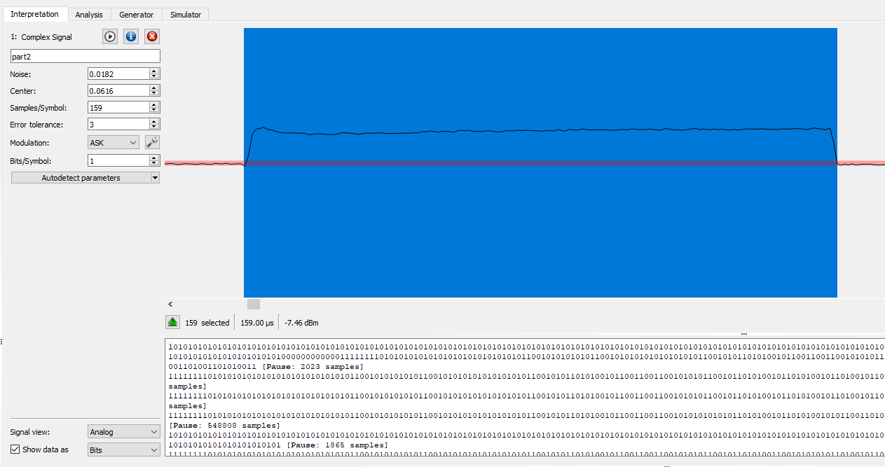
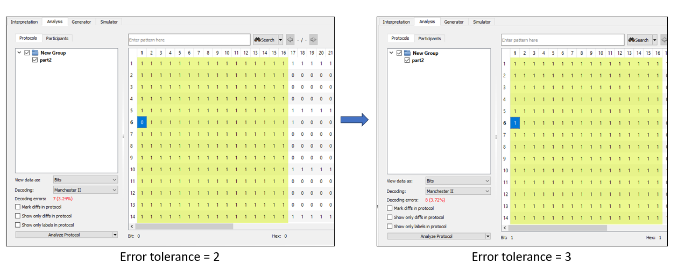

Pretty good CTF (for a noob like me)! I learned a lot from those challenges. Thanks to Willem Melching for creating this CTF.

## Easy Task
#### Volkswagen CAN Checksum
>**Challenge**
><br>&nbsp;&nbsp;&nbsp;&nbsp;The goal of this challenge is to compute the correct one byte checksum XX for the CAN message with payload XX0f0300. The flag is of the format CTF{XX}.
><br>
><br>**Background**
><br>&nbsp;&nbsp;&nbsp;&nbsp;VW uses the Autosar CRC8 8H2F checksum. Before computing the CRC, the payload is extended by a "secret" byte based on the Arbitration ID. Part of this challenge is figuring out what this "secret" byte is based on some traffic logged from the car. For some messages the "secret" value depends on the value of the counter, but that is not the case for this message.
><br>Example code to generate the CRC:
>```python
>import crcmod
>crc = crcmod.mkCrcFun(
>    poly=0x100 + polynomial,
>    initCrc=initial_value
>    rev=False,
>)
>data = payload + secret_byte
>checksum = crc(data) ^ 0xff
>```
><br>**Logged Messages**
><br>&nbsp;&nbsp;&nbsp;&nbsp;The following 15 messages were captured from the car. Note the first byte is the checksum of the message, then second byte contains a counter.
><br>&nbsp;&nbsp;&nbsp;&nbsp;*0&nbsp;&nbsp;&nbsp;74000300*
><br>&nbsp;&nbsp;&nbsp;&nbsp;*1&nbsp;&nbsp;&nbsp;c1010300*
><br>&nbsp;&nbsp;&nbsp;&nbsp;*2&nbsp;&nbsp;&nbsp;31020300*
><br>&nbsp;&nbsp;&nbsp;&nbsp;*3&nbsp;&nbsp;&nbsp;84030300*
><br>&nbsp;&nbsp;&nbsp;&nbsp;*4&nbsp;&nbsp;&nbsp;fe040300*
><br>&nbsp;&nbsp;&nbsp;&nbsp;*5&nbsp;&nbsp;&nbsp;4b050300*
><br>&nbsp;&nbsp;&nbsp;&nbsp;*6&nbsp;&nbsp;&nbsp;bb060300*
><br>&nbsp;&nbsp;&nbsp;&nbsp;*7&nbsp;&nbsp;&nbsp;0e070300*
><br>&nbsp;&nbsp;&nbsp;&nbsp;*8&nbsp;&nbsp;&nbsp;4f080300*
><br>&nbsp;&nbsp;&nbsp;&nbsp;*9&nbsp;&nbsp;&nbsp;fa090300*
><br>&nbsp;&nbsp;&nbsp;&nbsp;*10&nbsp;&nbsp;0a0a0300*
><br>&nbsp;&nbsp;&nbsp;&nbsp;*11&nbsp;&nbsp;bf0b0300*
><br>&nbsp;&nbsp;&nbsp;&nbsp;*12&nbsp;&nbsp;c50c0300*
><br>&nbsp;&nbsp;&nbsp;&nbsp;*13&nbsp;&nbsp;700d0300*
><br>&nbsp;&nbsp;&nbsp;&nbsp;*14&nbsp;&nbsp;800e0300*
><br>
><br>**References**
><br>&nbsp;&nbsp;&nbsp;&nbsp;Autosar CRC specification: https://www.autosar.org/fileadmin/standards/R22-11/CP/AUTOSAR_SWS_CRCLibrary.pdf
><br>

This chall is quite easy. From the PDF, we can tell that  CRC8 H2F use poly 0x2f, init value is 0xff. Base on 15 messages above, we can write a script to bruteforce the secret that will be used everytime.
Script:
```python
import crcmod

polynomial = 0x2f
initial_value = 0xff

crc = crcmod.mkCrcFun(
    poly=0x100 + polynomial,
    initCrc=initial_value,
    rev=False,
)

for i in range(0, 255):
    payload = b"\x00\x03\x00"
    data = payload + i.to_bytes(1, 'little')
    checksum = crc(data) ^ 0xff
    if checksum == 0x74:
        secret = i

print("Found secret: %d" % secret)

payload = b"\x0f\x03\x00" + secret.to_bytes(1, 'little')
checksum = crc(payload) ^ 0xff
print("FLAG: CTF{%2X}" % checksum)
```

```console
$python solve_checksum.py
[+] Found secret: 195
[+] FLAG: CTF{35}
```

## Medium Task
#### hittag2 Keyfob ID (part 1)
>**Challenge**
><br>&nbsp;&nbsp;&nbsp;&nbsp;This challenge contains a recording from a Keyfob featuring a Hitag2 cipher for RKE. The keyfob transmits a message containing a plaintext keyfob ID, counter and button followed by a MAC. Attached to this challenge you will find a SDR recording of 6 presses of the unlock button.
><br>&nbsp;&nbsp;&nbsp;&nbsp;Use URH to decode the messages from the keyfob and figure out the keyfob ID. The flag is of the form CTF{keyfob id}, e.g CTF{536c8dab}
><br>&nbsp;&nbsp;&nbsp;&nbsp;Refer to the following papers for more information on Hitag2 and the possible message structure.
><br>
><br>**References**
><br>&nbsp;&nbsp;&nbsp;&nbsp;URH download: https://github.com/jopohl/urh/releases
><br>&nbsp;&nbsp;&nbsp;&nbsp;Introduction to hitag2: https://www.usenix.org/system/files/conference/usenixsecurity12/sec12-final95.pdf
><br>&nbsp;&nbsp;&nbsp;&nbsp;Hitag2 as used in RKE, reference for message layout: https://www.usenix.org/system/files/conference/usenixsecurity16/sec16_paper_garcia.pdf
><br>

First, we need to setup URH. I use *Autodetect parameters* with 2 option:
* Additionally detect noise
* Additionally detect modulation

But when examining the sample, I see the Samples/Symbol is 159. So we need to tweak the settings.



From the PDF, we can see:
| Parameter      | Value |
| :---        |    :----:   |
| Working freq       | 433 Mhz       |
| Modulation       | ASK       |
| Encoding       | Manchester       |

Packet detail:
| Name      | Size (bit) | Description |
| :---        |    :----:   | :----: |
| SYNC | 16 | sync bit |
| UID | 32 | UID |
| BTN | 4 | Button identifier |
| CNTRL| 10 | Low part of Counter |
| KS | 32 | Keystream|
| CHK| 8 | Checksum bytes|

Since Hitag2 uses Manchester encoding, we need to use Manchester (I or II) decoding. First, I tried Manchester I and wrote a parser for it. However, I didn't get any valid output because the checksum was incorrect. The checksum is calculated as the XOR of all bytes, excluding the checksum byte itself and 2-bytes SYNC.

```console
$python hitag2_parse.py 0000fdffb8d5fc63a4e9b9d12a
[+] Packet bytes:
| 00 | 00 | FD | FF | B8 | D5 | FC | 63 | A4 | E9 | B9 | D1 | 2A |

[?] Wrong checksum: should be 2A - but got D5
```

So I tried using Manchester II. The first few packets had incorrect checksums, but the 4th one was valid, and I was able to parse it.
<br>One more thing, the default value of Error tolerance is 2. But some packet dont have a "good" SYNC, so I try to increase it by one and decode again. This time with Error tolerance = 3, all the packet has 0xffff SYNC



```console
$python hitag2_parse.py ffff0200472a039c5b16462ed5
[+] Packet bytes:
| FF | FF | 02 | 00 | 47 | 2A | 03 | 9C | 5B | 16 | 46 | 2E | D5 |

[+] Parsed data:
  [-] SYNC: 0xffff
  [-] UID: 0x200472a
  [-] Button: 0x0
  [-] Counter: 0xe7
  [-] keystream: 0x16c5918b
  [-] Checksum bytes: 0xd5
```
The flag is CTF{keyfobid}, so flag for part 1 is `CTF{200472a}`

Script:
```python
import sys

def check_sum(bytes_arr):
    checksum = 0
    for i in bytes_arr[2:-1]:
        checksum ^= i
    
    return checksum

if __name__ == "__main__":
    if len(sys.argv) != 2:
        print("Give me packet !!")
        exit(0)
    else:
        packet_hex = bytearray.fromhex(sys.argv[1])
        print("\n[+] Packet bytes:\n")
        for i in packet_hex:
            print("| %02X " % i, end="")
        print("|\n")

        ret = check_sum(packet_hex)
        if ret == packet_hex[-1]:
            print("[+] Parsed data:")

            sync = int.from_bytes(packet_hex[:2], byteorder='big')
            print("  [-] SYNC: 0x%x" % sync)
            
            keyfob_id = keyfob_id = int.from_bytes(packet_hex[2:6], byteorder='big')
            print("  [-] UID: 0x%x" % keyfob_id)

            button = packet_hex[6] >> 4 & 0xf
            print("  [-] Button: 0x%x" % button)

            counter = packet_hex[6] & 0xf
            counter = counter << 6
            counter += packet_hex[7] >> 2
            print("  [-] Counter: 0x%x" % counter)

            secret = int.from_bytes(packet_hex[8:12], byteorder='big')
            secret = secret >> 2
            secret += (packet_hex[7] & 0x3) << 30            
            print("  [-] keystream: 0x%x" % secret)

            print("  [-] Checksum bytes: 0x%x" % packet_hex[-1])

            print("[!] Flag part 1: CTF{%x}" % keyfob_id)
            print("\n[+] Part 2")

            iv = counter << 4 
            iv += button
            print("  [-] IV: 0x%08x" %iv)

            inver_ks = secret ^ 0xffffffff
            print("  [-] secret: 0x%08x" % inver_ks)
        else:
            print("[?] Wrong checksum: should be %2X - but got %2X" % (packet_hex[-1], ret))
```

## Hard Task
#### hittag2 Keyfob ID (part 2)
>**Challenge**
><br>&nbsp;&nbsp;&nbsp;&nbsp;This challenge contains a recording from a Keyfob featuring a Hitag2 cipher for RKE. The keyfob transmits a message containing a plaintext keyfob ID, counter and button followed by a MAC. Attached to this challenge you will find a SDR recording of 6 presses of the unlock button.
><br>&nbsp;&nbsp;&nbsp;&nbsp;Use URH to decode the messages from the keyfob and figure out the keyfob ID, button and keystream. Use this to crack the (equivalent) key that's inside the keyfob. The flag is of the form CTF{key}, e.g. CTF{1d81e7e1a6fe}.
><br>
><br>**References**
><br>&nbsp;&nbsp;&nbsp;&nbsp;Introduction to hitag2: https://www.usenix.org/system/files/conference/usenixsecurity12/sec12-final95.pdf
><br>&nbsp;&nbsp;&nbsp;&nbsp;Hitag2 as used in RKE, reference for message layout: https://www.usenix.org/system/files/conference/usenixsecurity16/sec16_paper_garcia.pdf
><br>&nbsp;&nbsp;&nbsp;&nbsp;Reference for cracking code, introduces "equivalent key": https://www.usenix.org/system/files/conference/woot18/woot18-paper-verstegen.pdf
><br>&nbsp;&nbsp;&nbsp;&nbsp;Hitag2 cracking code from proxmark3 . Use crack5 for CPU cracking, or crack5opencl for OpenCL based cracking: https://github.com/RfidResearchGroup/proxmark3/tree/master/tools/hitag2crack
><br>
><br>**Hints**
><br>&nbsp;&nbsp;&nbsp;&nbsp;The cracking code expects the UID and two pairs of IV and Keystream
><br>&nbsp;&nbsp;&nbsp;&nbsp;&nbsp;&nbsp;&nbsp;&nbsp;e.g. \<UID> \<nR1> \<aR1> \<nR2> \<aR2>
><br>&nbsp;&nbsp;&nbsp;&nbsp;nR is called IV in the papers, and is formed by concatenating CNTRH (assume 0, 18 bits), CNTRL (from received message, 10 bits) and BTN (from received message, 4 bits). CNTRH is on the MSB side, BTN on the LSB side.
><br>&nbsp;&nbsp;&nbsp;&nbsp;aR is the keystream. The cracking code expects the keystream to be inverted (^ 0xffffffff), see the test script for reference https://github.com/RfidResearchGroup/proxmark3/blob/master/tools/hitag2crack/hitag2_gen_nRaR.py#L134.
><br>&nbsp;&nbsp;&nbsp;&nbsp;If you have issues try using the python implementation from hitag2hell or proxmark to generate some examples to test the cracking.
><br>&nbsp;&nbsp;&nbsp;&nbsp;Hitag2 implementation in Python to verify results: https://github.com/factoritbv/hitag2hell/blob/master/pseudocode/hitag2.py
><br>

I used all the data from the first packet that was successfully parsed. There are a few things we need to note:
* The nonce is based on the Counter (CNTR). The full CNTR is 28 bits, but only the lower 10 bits are sent over the air. The upper 18 bits are unknown (I assume they are all zeros). The IV is Counter || Button ('||' denotes concatenation) <=> 0xe7 || 0x0 = 0xe70
* Cracking code expects the keystream to be inverted => keystream ^ (0xffffffff) <=> 0x16c5918b ^ 0xffffffff = 0xe93a6e74
* \<nR1> = 0xe70
* \<aR1> = 0xe93a6e74

With the hint, we can easy find the hitag2crack in proxmark3 git repo. There are crack1, 2, 3, 4 and 5. The author of first 4 is Kevin Sheldrake - he gave an excellent talk about cracking hitag2 crypto at 44CON (should watch !!). But from the hint, I went straight to crack5.
<br>We have \<UID> \<nR1> \<aR1>, now need another \<nR2> \<aR2>. I tried the next successful parsed packet, I compiled the crack5 and passed the param in.
```console
$python hitag2_parse.py ffff0200472a03a05749e7facf
[+] Packet bytes:
| FF | FF | 02 | 00 | 47 | 2A | 03 | A0 | 57 | 49 | E7 | FA | CF |

[+] Parsed data:
  [-] SYNC: 0xffff
  [-] UID: 0x200472a
  [-] Button: 0x0
  [-] Counter: 0xe8
  [-] keystream: 0x15d279fe
  [-] Checksum bytes: 0xcf

[+] Part 2
  [-] IV: 0xe80
  [-] secret: 0xea2d8601
```
* \<nR2> = 0xe80
* \<aR2> = 0xea2d8601

```python
$./ht2crack5 0200472a 00000e70 e93a6e74 00000e80 ea2d8601
Thread 0 slice 1/170
Thread 5 slice 1/170
Thread 1 slice 1/170
Thread 7 slice 1/170
Thread 6 slice 1/170
...
Thread 7 slice 23/170
Thread 11 slice 23/170
Thread 1 slice 23/170
Thread 0 slice 23/170
Thread 4 slice 23/170
Thread 5 slice 23/170
Thread 8 slice 23/170
Key: 72B7C3CCE726
```

We found key ?!! But let's verify it. I use a [script](https://github.com/factoritbv/hitag2hell/blob/master/pseudocode/hitag2.py) to verify if the key is correct we will get the same Keystream as first packet (the packet I mention at part 1).
```console
$python hitag2.py
Usage: python hitag2.py <initial state> | <key> <uid> <nonce>

$python hitag2.py 72b7c3cce726 0200472a 00000e70
[+] Keystream: 0x16c5918b
```
Noice !! Same keystream with part 1. So part 2 flag is:`CTF{72b7c3cce726}`

*To be continued...*
